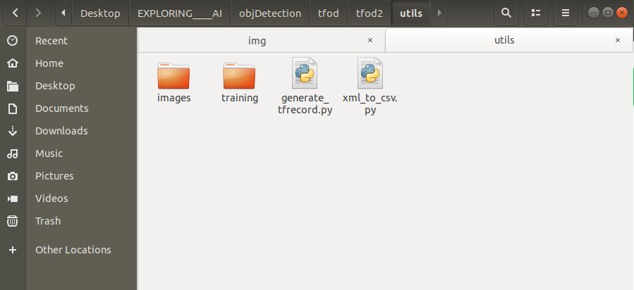
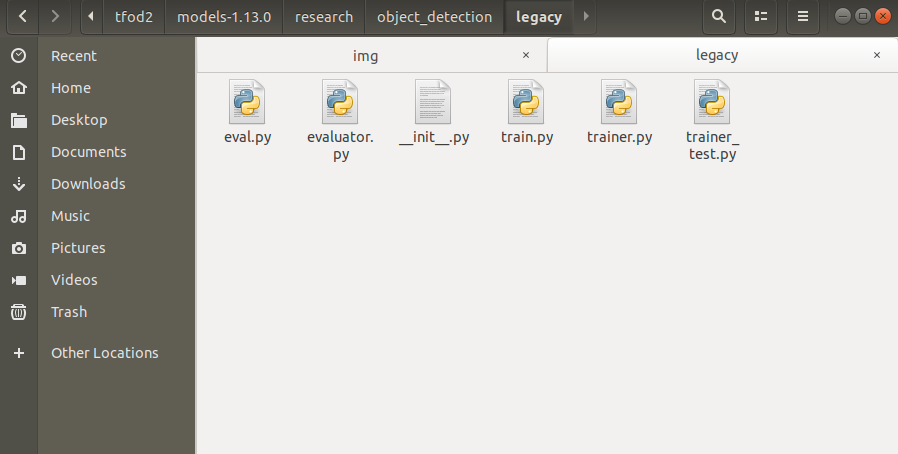
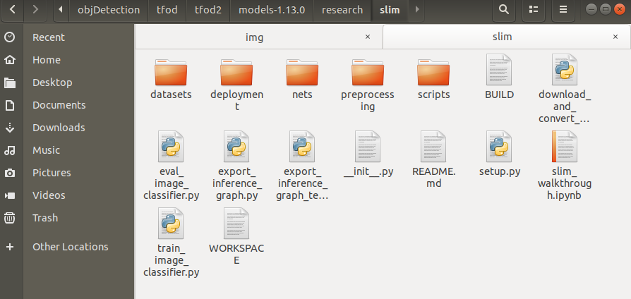

# Configuration steps for TensorFlow object detection-

## STEP-1 Download the following content- 

1. [Download](https://github.com/tensorflow/models/tree/v1.13.0) v1.13.0 model.

2. [Download](http://download.tensorflow.org/models/object_detection/ssd_mobilenet_v1_coco_2018_01_28.tar.gz) the ssd_mobilenet_v1_coco model from the model zoo **or** any other model of your choice from <a href="https://github.com/tensorflow/models/blob/master/research/object_detection/g3doc/detection_model_zoo.md" target="_blank">TensorFlow model zoo.</a>

3. [Download](https://drive.google.com/file/d/12F5oGAuQg7qBM_267TCMt_rlorV-M7gf/view?usp=sharing) Dataset & utils.


4. [Download](https://tzutalin.github.io/labelImg/) labelImg tool for labeling images.

before extraction, you should have the following compressed files - 


---

## STEP-2 Extract all the above zip files into a tfod folder and remove the compressed files-

Now you should have the following folders -


---


## STEP-3 Creating virtual env using conda-

!!! note "Commands"

    for specific python version

    ```
    conda create -n your_env_name python=3.6
    ```
    for latest python version
    ```
    conda activate your_env_name
    ```

---


## STEP-4 Install the following packages in your new environment- 

### for GPU
```
pip install pillow lxml Cython contextlib2 jupyter matplotlib pandas opencv-python tensorflow-gpu==1.14.0
```
### for CPU only 
```
pip install pillow lxml Cython contextlib2 jupyter matplotlib pandas opencv-python tensorflow==1.14.0
```

---

## STEP-5 Install protobuf using conda package manager-
```
conda install -c anaconda protobuf
```

---


## STEP-6 For protobuff to .py conversion download from a tool from here-

For windows -> [download](https://github.com/protocolbuffers/protobuf/releases/download/v3.11.0/protoc-3.11.0-win64.zip)
source for other versions and OS - <a href="https://github.com/protocolbuffers/protobuf/releases/tag/v3.11.4" target="_blank">click here</a> 

Open command prompt and cd to research folder.

Now in the research folder run the following command-

### For Linux or Mac
```
protoc object_detection/protos/*.proto --python_out=.
```

### For Windows
```
protoc object_detection/protos/*.proto --python_out=.
```

---


## STEP-7 Paste all content present in utils into research folder-

Following are the files and folder present in the utils folder-




---


## STEP-8 Paste ssd_mobilenet_v1_coco or any other model downloaded from model zoo into research folder-

Now cd to the research folder and run the following python file-

```
python xml_to_csv.py
```

---


## STEP-9 Run the following to generate train and test records-

from the research folder-
```
python generate_tfrecord.py --csv_input=images/train_labels.csv --image_dir=images/train --output_path=train.record
```

```
python generate_tfrecord.py --csv_input=images/test_labels.csv --image_dir=images/test --output_path=test.record
```

---


## STEP-10 Copy from _research/object_detection/samples/config/_ _YOURMODEL.config_ file into _research/training_-


!!! Note
    The following config file shown here is with respect to **ssd_mobilenet_v1_coco**. So if you have downloaded it for any other model apart from SSD you'll see config file with YOUR_MODEL_NAME as shown below-
    ```
    model {
    YOUR_MODEL_NAME {
      num_classes: 6
      box_coder {
        faster_rcnn_box_coder {
    ```

    **Hence always verify YOUR_MODEL_NAME before using the config file.**

---

## STEP-11 Update _num_classes, fine_tune_checkpoint_ ,and _num_steps_ plus update _input_path_ and _label_map_path_ for both _train_input_reader_ and _eval_input_reader_-


!!! info
    Changes to be made in the config file are highlighted in yellow color. You must update the value of those keys in the config file.


??? Note "Click here to see the full config file"
    ```JSON linenums="1" hl_lines="9 158 164 177 179 191 193"
    # SSDLite with Mobilenet v1 configuration for MSCOCO Dataset.
    # Users should configure the fine_tune_checkpoint field in the train config as
    # well as the label_map_path and input_path fields in the train_input_reader and
    # eval_input_reader. Search for "PATH_TO_BE_CONFIGURED" to find the fields that
    # should be configured.

    model {
      ssd {
        num_classes: 6
        box_coder {
          faster_rcnn_box_coder {
            y_scale: 10.0
            x_scale: 10.0
            height_scale: 5.0
            width_scale: 5.0
          }
        }
        matcher {
          argmax_matcher {
            matched_threshold: 0.5
            unmatched_threshold: 0.5
            ignore_thresholds: false
            negatives_lower_than_unmatched: true
            force_match_for_each_row: true
          }
        }
        similarity_calculator {
          iou_similarity {
          }
        }
        anchor_generator {
          ssd_anchor_generator {
            num_layers: 6
            min_scale: 0.2
            max_scale: 0.95
            aspect_ratios: 1.0
            aspect_ratios: 2.0
            aspect_ratios: 0.5
            aspect_ratios: 3.0
            aspect_ratios: 0.3333
          }
        }
        image_resizer {
          fixed_shape_resizer {
            height: 300
            width: 300
          }
        }
        box_predictor {
          convolutional_box_predictor {
            min_depth: 0
            max_depth: 0
            num_layers_before_predictor: 0
            use_dropout: false
            dropout_keep_probability: 0.8
            kernel_size: 3
            use_depthwise: true
            box_code_size: 4
            apply_sigmoid_to_scores: false
            conv_hyperparams {
              activation: RELU_6,
              regularizer {
                l2_regularizer {
                  weight: 0.00004
                }
              }
              initializer {
                truncated_normal_initializer {
                  stddev: 0.03
                  mean: 0.0
                }
              }
              batch_norm {
                train: true,
                scale: true,
                center: true,
                decay: 0.9997,
                epsilon: 0.001,
              }
            }
          }
        }
        feature_extractor {
          type: 'ssd_mobilenet_v1'
          min_depth: 16
          depth_multiplier: 1.0
          use_depthwise: true
          conv_hyperparams {
            activation: RELU_6,
            regularizer {
              l2_regularizer {
                weight: 0.00004
              }
            }
            initializer {
              truncated_normal_initializer {
                stddev: 0.03
                mean: 0.0
              }
            }
            batch_norm {
              train: true,
              scale: true,
              center: true,
              decay: 0.9997,
              epsilon: 0.001,
            }
          }
        }
        loss {
          classification_loss {
            weighted_sigmoid {
            }
          }
          localization_loss {
            weighted_smooth_l1 {
            }
          }
          hard_example_miner {
            num_hard_examples: 3000
            iou_threshold: 0.99
            loss_type: CLASSIFICATION
            max_negatives_per_positive: 3
            min_negatives_per_image: 0
          }
          classification_weight: 1.0
          localization_weight: 1.0
        }
        normalize_loss_by_num_matches: true
        post_processing {
          batch_non_max_suppression {
            score_threshold: 1e-8
            iou_threshold: 0.6
            max_detections_per_class: 100
            max_total_detections: 100
          }
          score_converter: SIGMOID
        }
      }
    }

    train_config: {
      batch_size: 24
      optimizer {
        rms_prop_optimizer: {
          learning_rate: {
            exponential_decay_learning_rate {
              initial_learning_rate: 0.004
              decay_steps: 800720
              decay_factor: 0.95
            }
          }
          momentum_optimizer_value: 0.9
          decay: 0.9
          epsilon: 1.0
        }
      }
      fine_tune_checkpoint: "ssd_mobilenet_v1_coco_2018_01_28/model.ckpt"
      from_detection_checkpoint: true
      # Note: The below line limits the training process to 200K steps, which we
      # empirically found to be sufficient enough to train the pets dataset. This
      # effectively bypasses the learning rate schedule (the learning rate will
      # never decay). Remove the below line to train indefinitely.
      num_steps: 20000
      data_augmentation_options {
        random_horizontal_flip {
        }
      }
      data_augmentation_options {
        ssd_random_crop {
        }
      }
    }

    train_input_reader: {
      tf_record_input_reader {
        input_path: "train.record"
      }
      label_map_path: "training/labelmap.pbtxt"
    }

    eval_config: {
      num_examples: 8000
      # Note: The below line limits the evaluation process to 10 evaluations.
      # Remove the below line to evaluate indefinitely.
      max_evals: 10
    }

    eval_input_reader: {
      tf_record_input_reader {
        input_path: "test.record"
      }
      label_map_path: "training/labelmap.pbtxt"
      shuffle: false
      num_readers: 1
    }

    ```

---


## STEP-12 From _research/object_detection/legacy/_ copy _train.py_ to research folder

legacy folder contains train.py as shown below - 


---


## STEP-13 Copy deployment and nets folder from research/slim into the research folder-

slim folder contains the following folders -




---

## STEP-14 NOW Run the following command from the research folder. This will start the training in your local system-

!!! NOTE
    copy the command and replace **YOUR_MODEL.config** with your own model's name for example **ssd_mobilenet_v1_coco.config**
```
python train.py --logtostderr --train_dir=training/ --pipeline_config_path=training/YOUR_MODEL.config
```

---

!!! Warning
    Always run all the commands in the research folder.