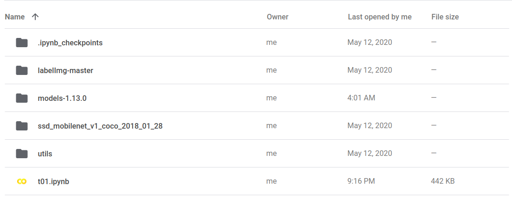
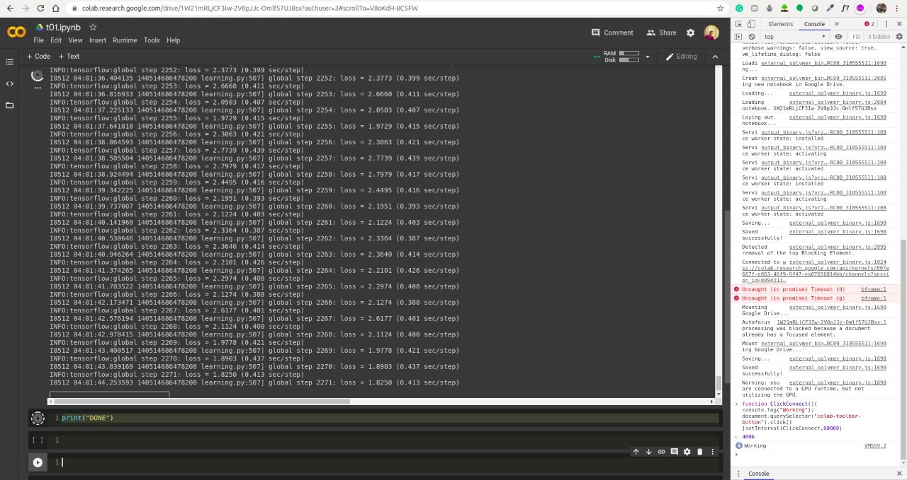

# Google Colab setup for tfod

Steps to start training in Google Colab for tfod-

### STEP 1. Do all the necessary steps shown on the previous page in your local system except the last step where training starts-

!!! note
    I mean do everything before the following step-
    ```
    python train.py --logtostderr --train_dir=training/ --pipeline_config_path=training/ssdlite_mobilenet_v1_coco.config
    ```

---

### STEP 2.Move whole tfod folder to your google drive.
verify that it should have atleast the below content-



!!! note
    I'm using the ssd_mobilenet_v1_coco model that's I have ssd_mobilenet_v1_coco folder in the screenshot. You can upload your choice of the model there.

??? tip
    Since you have already done tfod set up in your local system and already copied utils and your model zoo folder (i.e ssd_mobilenet_v1_coco in my case).
    
    So if you want then you can only upload models-1.13.0 , folder instead of all of them.
    
    Here I have uploaded all of them just to replicate the exact same steps in local and Google Colab.
---

### STEP 3. Open a jupyter notebook in the root of your folder structure. I mean just inside the tfod folder.

As you can see in the below screenshot you can see **t01.ipynb**.


---

### STEP 4. Mount the drive in Colab and initialize it with GPU.

#### Refer the following video -

<p style="text-align: center;">
<iframe width="700" height="330" src="https://www.youtube.com/embed/6fWG4cxKqBM" frameborder="0" allow="accelerometer; autoplay; encrypted-media; gyroscope; picture-in-picture" allowfullscreen></iframe>
</p>
---

### STEP 5. In the first cell run the following command so that it selects TensorFlow 1 for the training-

```
%tensorflow_version 1.x
```

---

### STEP 6. In the notebook import os. And set a path to the research directory in a Variable as per your google drive.

```python hl_lines="2"
import os
RESEARCH_DIR = "/content/drive/My Drive/PATH_TO_TFOD/tfod/models-1.13.0/research"
```

---

### STEP 7. Run the following line to change the directory-

```python
os.chdir(RESEARCH_DIR)
```

---

### STEP 8. Run the following line to verify that you are in the research folder-

```python
os.getcwd()
```

---

### STEP 9. Now run the training command to start the training in Google Colab- 

!!! Note
    Change the name of the config file as per your model name 
    ```
    !python train.py --logtostderr --train_dir=training/ --pipeline_config_path=training/ssdlite_mobilenet_v1_coco.config
    ```

---


### STEP 10. Copy and paste following code in your browser console to prevent  Google Colab from terminating- 

JS code[^1]-

```javascript
function ClickConnect(){
console.log("Working"); 
document.querySelector("colab-toolbar-button").click() 
}setInterval(ClickConnect,60000)
```

Refer the video below for final setup - 

<p style="text-align: center;">
<iframe width="700" height="330" src="https://www.youtube.com/embed/ZFsginiVzX8" frameborder="0" allow="accelerometer; autoplay; encrypted-media; gyroscope; picture-in-picture" allowfullscreen></iframe>
</p>


---

## Screenshot of Google Colab code- 


---

## Screenshot of begining of final training- 



[^1]:
    "How to prevent Google Colab from disconnecting ?" | <a href="https://medium.com/@shivamrawat_756/how-to-prevent-google-colab-from-disconnecting-717b88a128c0" target="_blank">MEDIUM BLOG</a>